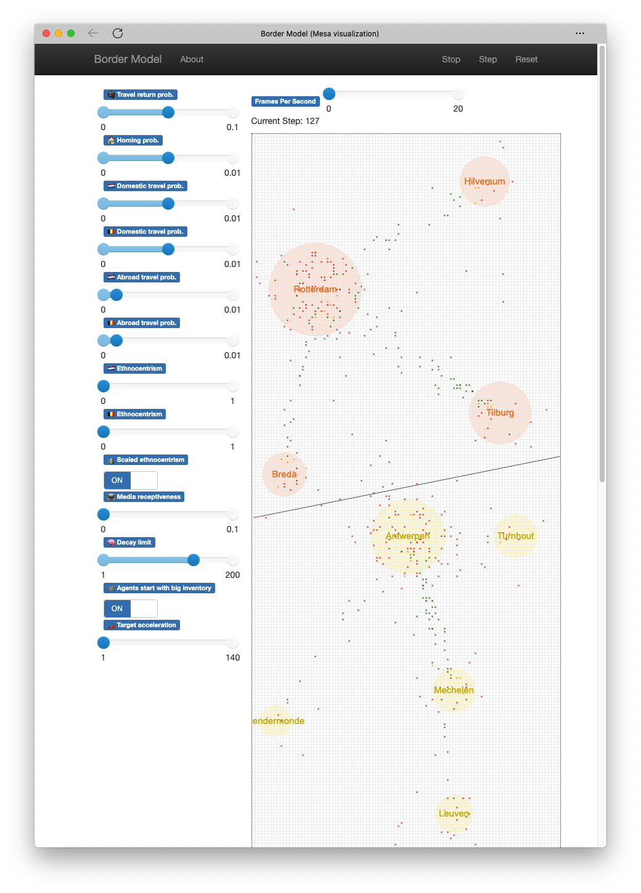

# BorderModel

This repository contains all code for my agent-based simulation of the divergence of the standard language pronunciation in the Netherlands and Belgium.



## Set-up

To set up the model, follow these instructions:

1. Clone the repository:  
	`git clone https://github.com/AntheSevenants/BorderModel.git`
2. Navigate to the repository:  
	`cd BorderModel`
3. Create a virtual environment:  
	`python3 -m venv venv`
4. Activate the virtual environment:  
	`source venv/bin/activate`
5. Install the dependencies:  
	`pip install -r requirements.txt`

The virtual environment needs to be active in order to be able to run the model. You can check whether the virtual environment is activated by checking whether there is (venv) in front of your user@hostname.

## Running the model

If you want to run the **interactive session** (shown in the screenshot above), start the model server with `python3 BorderServer.py`. You will be able to access the interface from your browser at http://127.0.0.1:8521.

If you want to run simulations **in bulk**, use the BorderThink.py program. You can learn how to use BorderThink by entering `python3 BorderThink.py -h`. When the simulations are finished, a CSV report will be generated for you.

## Bugs

There is a problem with the BorderThink program which sometimes causes two colums to switch places. The arguments which were actually fed to the simulation are correct, but the report has the data in the wrong columns. The bug only occurred for large-scale simulations (which generally take days to finish), so I was not able to fix the bug. I simply corrected the reports afterwards using R Studio.

## Proxy

If you use nginx and would like to reverse-proxy your simulation frontend so you can access it from a more accessible URL (e.g. yoursite.com/mesa), you can use the following configuration snippet. It goes in a server block.

```
location /mesa/
{
    client_max_body_size 0;

    proxy_pass http://127.0.0.1:8521/;
    sub_filter '/static/' '/mesa/static/';
    sub_filter '/local/' '/mesa/local/';
    sub_filter '/ws' '/mesa/ws';
    sub_filter_types *;
    sub_filter_once off;
    proxy_http_version 1.1;
    proxy_set_header Upgrade $http_upgrade;
    proxy_set_header Connection 'upgrade';
    proxy_set_header Host $host;
    proxy_cache_bypass $http_upgrade;

    proxy_set_header X-Real-IP $remote_addr;
}
```